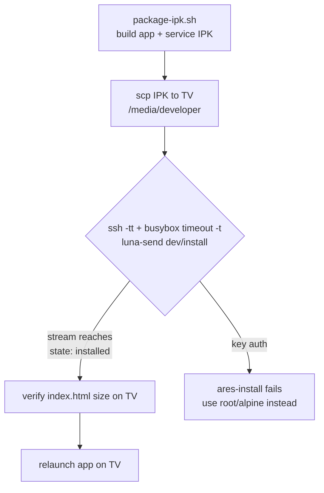

# Deploy Sendspin Cinema to a webOS TV

One command does everything (build → copy → install → verify):

```sh
scripts/deploy-tv.sh [HOST] [PASSWORD]
# defaults: HOST=192.168.1.32  PASSWORD=alpine  APP_ID=com.sendspin.cinema
# env: TV_HOST, TV_PASS, APP_ID, SKIP_BUILD=1 (reuse existing dist/*.ipk)
```

Prefer this script. Only hand-run the steps below when debugging the script itself.

## Why not `ares-install`

`ares-install -d <device>` needs the LG dev-mode SSH **key**. It commonly fails
with `All configured authentication methods failed`. We use plain **root SSH**
(dev-mode root password, classically `alpine`) + the on-TV dev install Luna
service instead — reliable, no key setup.

## Non-obvious gotchas (already handled in the script)

- **`ssh -tt` is mandatory.** `luna-send -i` streams install status only over a
  real PTY. Without a TTY the call returns `EXIT=0`, prints nothing, and
  installs nothing. This is the trap that eats iterations.
- **busybox `timeout` syntax is `-t SECONDS`.** GNU `timeout 25 cmd` fails with
  `can't execute '25': No such file or directory`.
- **Copy the IPK to the TV first.** `dev/install` reads `ipkUrl` from the TV
  filesystem (`scp` to `/media/developer/`), not from the host.
- **Verify by size/marker.** Installed app lives at
  `/media/developer/apps/usr/palm/applications/com.sendspin.cinema/`. A stale
  install leaves the old `index.html` size; `grep -c <marker>` confirms the new
  code landed. Success state in the stream is `"state": "installed"`.

## Manual fallback

```sh
H=192.168.1.32; P=alpine; A=com.sendspin.cinema
S="-o StrictHostKeyChecking=no -o UserKnownHostsFile=/dev/null"
./package-ipk.sh
sshpass -p $P scp $S dist/*.ipk root@$H:/media/developer/x.ipk
sshpass -p $P ssh -tt $S root@$H \
  "timeout -t 90 luna-send -i -f luna://com.webos.appInstallService/dev/install \
   '{\"id\":\"$A\",\"ipkUrl\":\"/media/developer/x.ipk\",\"subscribe\":true}'"
```

## Flow


