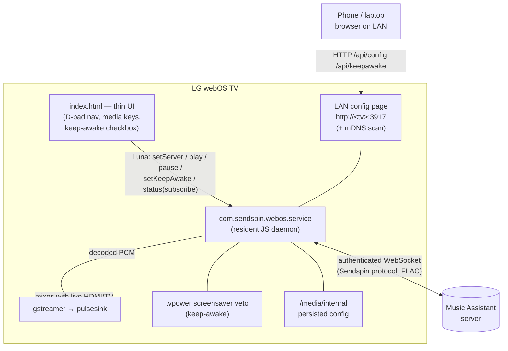

# Sendspin Cinema Player for LG webOS 🎬🎵

A cinema-inspired **Music Assistant** player for LG webOS TVs. The on-screen UI is
beautiful and minimal — glowing progress bar, album-art-driven accent colors — but
the real change since the original is underneath: a **background audio daemon** now
holds the Music Assistant connection and plays audio that **mixes with whatever is
already on screen** (live TV / HDMI), and **keeps playing/connected even when the app
isn't in the foreground**.

> This is a heavily extended fork of the original **Sendspin Cinema** web app. The
> original was a single `index.html` that talked to Music Assistant directly from the
> browser. This version re-architects it into a resident daemon + thin UI (see below)
> and adds LAN setup, on-device audio decoding, persistence, full-remote navigation,
> and a keep-the-TV-awake option.

---

## ✨ Features

* **Background audio daemon.** A webOS JS Service (`com.sendspin.webos.service`) holds
  a single, authenticated WebSocket to Music Assistant and stays resident via a
  keep-alive activity — playback and connection survive the UI being backgrounded.
* **Audio mixed with live TV.** Audio is decoded **on-device with gstreamer**
  (`gst-launch → pulsesink`) so it mixes with the current HDMI/TV picture instead of
  taking over audio focus.
* **Cinema aesthetic + dynamic colors.** Dark immersive background, glowing progress
  bar, and an accent color extracted from the album art (Vibrant.js).
* **Set up from your phone/laptop.** The service runs a small **LAN config web page**
  (and **mDNS discovery** of Music Assistant servers) so you can configure the TV with
  a real keyboard instead of the remote.
* **Full remote navigation.** D-pad navigation on both the setup screen (move between
  fields, pick scanned servers) and the now-playing screen (reach the gear + transport
  buttons), plus hardware media keys (Play/Pause/Stop/Next/Prev).
* **Keep TV awake.** Optional checkbox (in the app *and* the LAN page) that vetoes the
  webOS screensaver so an audio-only session doesn't blank the panel.
* **Config that survives reinstall & reboot.** Server, credentials, player name,
  default volume, and keep-awake are persisted on the TV's internal partition and
  restored on startup — the service reconnects on its own.
* **Stream-only volume + default volume.** Volume changes affect only this player's
  stream (they don't skip/disturb the track), with a configurable default applied to a
  fresh player.

---

## 🧠 Architecture

The UI is a **thin Luna client**: it never talks to Music Assistant directly. It pushes
config + transport commands to the background service and renders the status the
service subscribes it to. The same service also serves the LAN config page, so the app
UI and the web page are two front-ends over one source of truth.



**Repo layout**

| Path | What it is |
| --- | --- |
| `index.html` | The cinema UI (thin Luna client). |
| `services/com.sendspin.webos.service/` | Background daemon: MA client (`sendspin-core.js`), gstreamer sink (`gst-sink.js`), LAN config server (`config-http.js`), mDNS discovery (`mdns-discover.js`), persistence (`persist.js`). |
| `native/audio-helper/` | Phase-1 research spike (C/PulseAudio) that proved background audio mixes with live HDMI. Not shipped — production uses gstreamer. |
| `package-ipk.sh` | Builds a **single IPK** containing both the app and the service. |
| `scripts/deploy-tv.sh` | One-command build → copy → install over root SSH (see below). |
| `docs/` | Design + progress notes for the daemon conversion. |

---

## 🚀 Installation

This is an unofficial app, installed via LG **Developer Mode**.

### Prerequisites
1. Install **Developer Mode** from the LG Content Store and log in; enable **Dev Mode
   Status** and **Key Server**. Note the TV's IP and passphrase.
2. Install [webOS CLI tools (ares-cli)](https://webostv.developer.lge.com/develop/tools/cli-introduction)
   and **Node.js** on your computer (the build bundles the service's `ws` dependency
   and transpiles the MA core).

### Build the IPK
```bash
./package-ipk.sh
# -> dist/com.sendspin.webos_<version>_all.ipk  (app + service in one package)
```

### Install it

**Option A — ares-cli (dev key):**
```bash
ares-setup-device                       # add your TV (IP, port 9922, user 'prisoner')
ares-install -d <YOUR_DEVICE> dist/com.sendspin.webos_*.ipk
```

**Option B — root SSH helper (`scripts/deploy-tv.sh`):**
If the dev SSH key isn't loaded (a common `ares-install` failure), use the bundled
script, which builds, copies, and installs over plain root SSH and streams the install
status:
```bash
scripts/deploy-tv.sh <TV_IP> <ROOT_PASSWORD>     # e.g. 192.168.1.32 alpine
SKIP_BUILD=1 scripts/deploy-tv.sh <TV_IP>        # reuse the existing dist/*.ipk
```
(Requires `sshpass`. See `.claude/skills/deploy-tv/SKILL.md` for the why/gotchas.)

---

## ⚙️ Configuration

You can configure the player two ways — both write to the same persisted config:

* **On the TV:** open the gear icon (D-pad ↑/↓/←/→ to reach it, **OK** to open), then
  enter the server, optional credentials, player name, default volume, and toggle
  **Keep TV awake**. You can **Scan** for Music Assistant servers to avoid typing an IP.
* **From a browser on the same network:** open the URL shown on the setup screen
  (`http://<tv-ip>:3917`) and configure with a real keyboard. The keep-awake checkbox
  here applies immediately.

### ⚠️ Make the player visible in Music Assistant
Music Assistant often hides newly discovered custom web players by default:
1. Open Music Assistant → **Settings → Players**.
2. Find the player name you entered (check the *Disabled* / *Hidden* list).
3. Open its settings and **uncheck "Hide this player in the user interface"**.
4. Your TV is ready to play music.

---

## 📝 Notes & limitations

* **Keep TV awake** blocks the webOS **screensaver / panel blanking**. It does **not**
  override the separate multi-hour *Auto Power Off* inactivity timer — disable that in
  **Settings → General → Auto Power Off** if you want truly indefinite playback.
* Audio decoding relies on the TV's on-device **gstreamer** (the bundled Node is too old
  for WASM decoders). FLAC is validated; exotic codecs may need MA-side transcoding.
* The service is **jailed**: only `/media/internal` (and `/tmp`) are writable, which is
  where config is persisted.

---

## ☕ Support the Project
If this made your home theater better, consider buying me a coffee!

[](https://buymeacoffee.com/daredoes)
