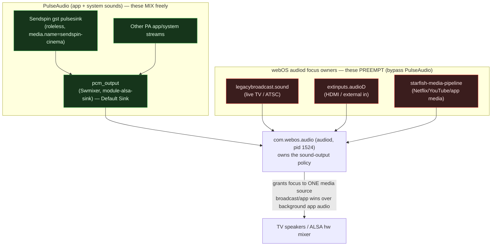

# Audio concurrency — why the music stops, and where it can't be fixed in PulseAudio

> Question: *"the music stream gets stopped when audio from another channel plays —
> can we play simultaneously?"*

Short answer: **at the PulseAudio layer we already mix simultaneously.** The stop
comes from a layer *above* PulseAudio — webOS `audiod` / the broadcast + media
pipelines taking audio focus. Fixing it (if possible at all) is an `audiod`-level
change, not a PulseAudio role tweak.

## What was measured on-device (`root@192.168.1.32`, PulseAudio 9.0, armv7l)

| Experiment | Result |
|---|---|
| Two PulseAudio app streams at once (ours roleless + an intruder `media.role=media`) | **Both `Corked: no`, both on `pcm_output`** — they mix, nothing is stopped |
| webOS TTS (`luna://com.webos.service.tts`) while our stream plays | Our stream stays `Corked: no` |
| Stream tagged `media.role=music` | Stays on `pcm_output` (Sink 1), `Corked: no` — **not** diverted to a silent null-sink |

So `module-palm-policy` on this firmware does **not** cork our background stream
when another *PulseAudio* stream starts. The "music stops" the user sees is a
different, higher-priority source: **live TV / broadcast / a streaming app**, which
does not go through PulseAudio at all.

## The audio stack (where the preemption actually happens)

* HDMI/TV audio "mixes for free" (Phase-1 finding) because it is hardware-mixed
  *downstream* of PulseAudio.
* **Live broadcast / streaming-app media is different:** it registers with `audiod`
  as a media focus owner, and webOS policy gives a foreground media source the
  output, suspending the background-app mix. PulseAudio stream properties can't
  override that — the decision is made above PulseAudio.

## What this means for a fix

PulseAudio-side levers (`media.role`, stream priority, anti-cork) **won't help** —
they were already not the thing stopping us. The only place to influence this is
`com.webos.audio` (audiod) policy. Candidate experiments, in order of safety:

1. **Register our stream with `audiod` under a concurrent audio type.** Types with
   their own always-on ALSA sink (e.g. TTS → `ptts`, alerts) play *over* media. If
   we can route/register as a non-media type that audiod won't preempt, the music
   survives a channel change. Risk: those types may duck/limit buffering.
2. **Re-assert on focus change.** Subscribe to `audiod` status; when a media source
   grabs focus and suspends us, re-connect/re-request our stream. Best case it
   resumes quickly; worst case audiod refuses while broadcast holds exclusive focus.
3. **Accept it as a firmware limit.** A hard broadcast-exclusive grab may be
   unoverridable from a dev-mode app; then the answer is "no, not while live TV is
   the active source."

> ⚠️ Do **not** blindly add `media.role` to `gst-sink.js` playArgs as a "fix" — the
> current sink is hardware-validated and the measurements show role is not the
> lever. Any change here must be verified on-device with **MA actively streaming**
> plus a **real second source (live TV / an app) and ears**, which the remote CLI
> session can't do.

## To reproduce / verify a fix (needs a human at the TV)

1. Start MA playback so Sendspin is actually streaming (`pactl list sink-inputs`
   shows a live `sendspin` input on `pcm_output`, `Corked: no`).
2. Switch to live TV or open a streaming app → confirm the Sendspin input goes
   `Corked: yes` / suspended (this is the bug, and pinpoints audiod as the cause).
3. Apply an audiod-side change from the list above, repeat, and listen for both
   sources together.
