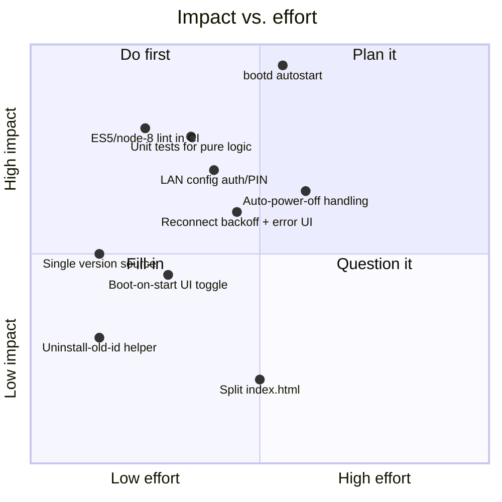

# Improvement ideas

A working backlog of things that would make **Sendspin webOS daemon** more robust,
safer, and easier to work on. Grouped by theme; the chart plots rough impact vs.
effort so the high-impact / low-effort items are obvious.

## 1. Reliability / lifecycle

* **bootd autostart (the big one).** The daemon only becomes resident *after the app is
  opened once* (it grabs the keep-alive activity then). After a TV reboot the player is
  dead until someone launches the app. `setBootOnStart` already exists in the service
  but is a no-op TODO. Register a `bootd` / ActivityManager boot activity so the player
  is reachable (and auto-reconnects) straight after power-on. **Highest user-visible win.**
* **Reconnect backoff + surfaced errors.** Make the MA WebSocket reconnect with capped
  exponential backoff and reflect failure states (`error`, retry countdown) in both the
  app pill and the LAN page, instead of a silent stall.
* **Auto Power Off.** Keep-awake blocks the *screensaver* but not webOS's multi-hour
  inactivity power-off. Investigate whether the service can defer it (periodic activity
  / `tvpower` inactivity reset); if not, document it prominently (already noted in README).

## 2. Quality / guardrails

* **ES5 + node-8 lint in CI.** The service must stay node 8.12-safe (no arrow fns, no
  optional chaining, no class fields) — today that's manual discipline. Add ESLint with
  `parserOptions.ecmaVersion` pinned and `env: { es6: false }`-style rules so a stray
  arrow fn fails CI instead of crashing on-device.
* **Unit tests for pure logic.** Several pieces are pure and testable on plain node in CI
  with no TV: `buildServer`/`clampVol`/`buildBaseUrl`, `persist` serialization, and the
  `config-http` route table. Extract the app's `buildServer`/`formatTime` helpers so they
  can be imported and tested too. Wire into `release.yml` before packaging.
* **Rename/consistency check.** A tiny CI grep guard: fail if `com.sendspin.cinema`
  reappears, or if app/service IDs drift out of the `appId` ⊂ `serviceId` prefix rule.

## 3. Security (LAN config surface)

* **The config page is unauthenticated on `0.0.0.0:3917`.** Anyone on the LAN can read
  status (server, username) and POST a new config/keep-awake. Passwords are correctly
  *not* echoed in the snapshot, but the write surface is open. Add a lightweight PIN/token
  (shown on the TV screen, required by `/api/*`), or bind to a confirmation, or at minimum
  document the "trusted LAN only" assumption.
* **Credential storage.** MA password lives plaintext in `localStorage` and the persisted
  config file. Acceptable for a TV appliance, but worth a note in the README and a thought
  about obfuscation-at-rest.

## 4. Developer experience

* **Single version source.** `appinfo.json` is `1.0.1` while the service `package.json` is
  `1.0.0`. Pick one source and stamp both at build time; bump in CI on tagged release.
* **Uninstall helper for the old app id.** Renaming to `com.sendspin.webos` leaves
  the old `com.sendspin.cinema` installed on every TV (and its persisted config doesn't
  carry over — different jail). Add a `scripts/uninstall-tv.sh` (dev/remove via Luna) and
  document the one-time migration.
* **Make/npm task wrappers.** `npm run package` / `npm run deploy -- <ip>` around the
  existing scripts, so the entry points are discoverable without reading shell.

## 5. Feature polish (lower priority)

* **Boot-on-start UI toggle** wired to `setBootOnStart` (once bootd autostart lands).
* **Album-art caching / graceful placeholder** when artwork fails to load.
* **Volume normalization / simple EQ** options surfaced from MA.
* **Split `index.html`** into `app.css` / `app.js` if it keeps growing (WAM is fine with a
  monolith today, so this is cosmetic).

---

> Suggested order: **bootd autostart → ES5 lint + unit tests in CI → LAN config PIN →
> single version source.** The first removes the biggest "why isn't it playing after a
> reboot" surprise; the next two stop regressions that only show up on-device.
