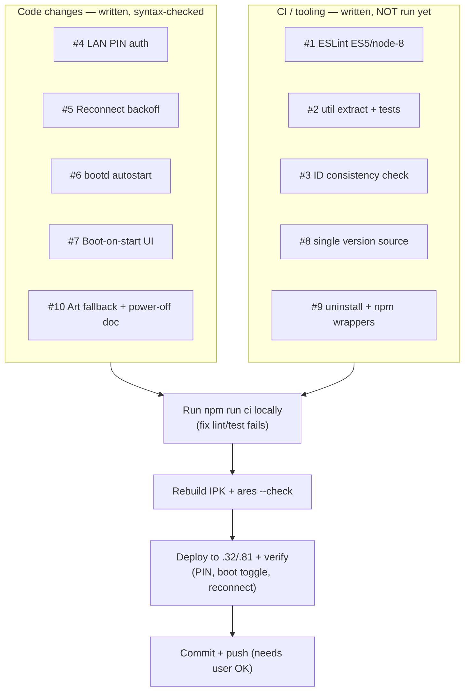

# Improvements — progress & plan

Implementation status of the backlog in [`IMPROVEMENTS.md`](./IMPROVEMENTS.md).
Last updated mid-implementation. **Nothing is committed yet**, and the local CI
run (`check:ids` / `lint` / `test`) was **not yet verified** — that is the next step.

## Status by task

| # | Task | Status | Notes |
|---|------|--------|-------|
| 1 | ESLint ES5/node-8 guardrail | 🟡 written | `.eslintrc.json` (`ecmaVersion 2018` → parse-errors on optional chaining / nullish / class fields, the node-8 breakers). `npm run lint` over the 8 runtime service files. **Not run yet.** |
| 2 | Unit tests for pure logic | 🟡 written | Extracted `services/.../util.js` (`clampVol`, `buildBaseUrl`, `buildServer`, `makePin`); `test/util.test.js` + `test/config-http.test.js` (route + PIN-gate integration) via `node --test`. **Not run yet.** |
| 3 | ID / version consistency check | 🟡 written | `scripts/check-ids.sh`: fails on stray `com.sendspin.cinema`, service-id ≠ `<appId>.service`, or version drift. **Not run yet.** |
| 4 | LAN config PIN auth | ✅ implemented | Service generates+persists a 4-digit PIN, exposes it in `snapshot()`. `config-http` gates **writes** (`/api/config`, `/api/keepawake`, `/api/bootonstart`) behind it (header `x-sendspin-pin` or body `pin`); reads stay open. App shows the PIN in the LAN hint. |
| 5 | Reconnect backoff + error surfacing | ✅ implemented | Capped exponential backoff (2s→60s) on connect/login failure; `clearReconnect` on success/user action; `retrying`/`nextRetryMs` in status; app pill + web page show "Reconnecting in Ns". |
| 6 | bootd autostart + `setBootOnStart` | ✅ implemented ⚠️ | Registers a persistent ActivityManager boot activity; wired to `setBootOnStart` + restored on startup. **Needs hardware verification across a real power cycle** (dev-service autostart is firmware-dependent). |
| 7 | Boot-on-start UI toggle | ✅ implemented | "Start on boot" toggle in the app (D-pad reachable) and the LAN page, both driving `setBootOnStart`. |
| 8 | Single version source | 🟡 written | `package-ipk.sh` stamps the staged service `package.json` version from `appinfo.json`; source synced to `1.0.1`; `check-ids.sh` enforces equality. **Build not re-run yet.** |
| 9 | Uninstall helper + npm wrappers | 🟡 written | `scripts/uninstall-tv.sh` (dev/remove, defaults to the old `com.sendspin.cinema` for migration); root `package.json` scripts: `package`/`deploy`/`uninstall`/`lint`/`test`/`check:ids`/`ci`. |
| 10 | Album-art fallback + power-off doc | ✅ implemented | `cover-art` `onerror` falls back to the loader glyph; Auto Power Off limitation already documented in the README "Notes & limitations". |

## Files touched (uncommitted)

* **App:** `index.html` — boot toggle, PIN display, reconnect pill, art `onerror`.
* **Service:** `service.js` (util, reconnect, PIN, boot activity, `setBootOnStart`, snapshot fields), `config-http.js` (PIN gate, `/api/bootonstart`, PIN + boot UI), `util.js` (new), `package.json` (version 1.0.1).
* **Tooling:** `package.json` (root, new), `.eslintrc.json` (new), `.github/workflows/ci.yml` (new), `scripts/check-ids.sh` + `scripts/uninstall-tv.sh` (new), `package-ipk.sh` (util + version stamp), `.gitignore` (node_modules).
* **Tests:** `test/util.test.js`, `test/config-http.test.js` (new).
* **Docs:** `docs/IMPROVEMENTS.md`, this file.

## Remaining plan

1. ~~**Run `npm run ci`**~~ ✅ **green** (`check:ids` → `lint` → `test`, 6/6). Fixes made: `check:ids` now excludes the migration scripts (`check-ids.sh`, `uninstall-tv.sh`) that reference the old id on purpose; regenerated the stale service `package-lock.json` (still named the old id); scoped `npm test` to `test/*.test.js` so the on-device `test-real-sink.js` isn't swept up by autodiscovery.
2. ~~**Rebuild the IPK**~~ ✅ `dist/com.sendspin.webos_1.0.1_all.ipk`, `ares-package` validation clean.
3. ~~**Deploy + verify on hardware** (`192.168.1.32`)~~ ✅ installed; service registers on the Luna bus, reconnects to MA, persisted config restored (PIN, volume 55, boot-on-start). See rename fix below.
4. **Commit + push** — still pending user authorization (push to `main` requires explicit OK).

### 🔴 Rename regression found + fixed on hardware

The earlier rename `com.sendspin.cinema` → **`com.sendspin.webos-daemon`** introduced a
**hyphen into the Luna *service* bus name** (`com.sendspin.webos-daemon.service`).
webOS Luna service names are reverse-DNS `[a-z0-9.]` only — `LSUriParse` rejects the
hyphen, so the service **never registered on the bus** and *every* app→service call
(play/pause/next/setServer/keepawake/…) silently failed. The app looked alive only
because the resident daemon self-starts from *persisted* config and the LAN page talks
to it in-process, not over Luna. On the bus, only the legacy `com.sendspin.cinema.service`
was actually running.

**Fix:** renamed app → **`com.sendspin.webos`**, service → **`com.sendspin.webos.service`**
(hyphen-free, keeps the `appId + ".service"` rule `check-ids.sh` enforces). Verified on
`192.168.1.32`: service now registers as `com.sendspin.webos.service` (dynamic node
service) and cold-starts on a Luna call. Old `com.sendspin.cinema` + `com.sendspin.webos-daemon`
uninstalled from the TV.

### ✅ Verified on the bus / ⚠️ app-control E2E still needs a stable TV

Confirmed on `192.168.1.32`: with the hyphen-free name the service **registers on the
Luna bus** (`ls-monitor -l` shows `com.sendspin.webos.service`, dynamic node service)
and the hub cold-starts it on a call — both impossible under the old hyphenated name.
What I could **not** cleanly confirm from the CLI is end-to-end *app → service method
delivery*: root `luna-send` isn't a faithful proxy for the app's WebAppMgr caller
identity (calls came back empty), and the test TV is flaky/overloaded (load avg ~36 per
project memory) — the dynamic service idle-exited between calls and launches raced, so
observations were inconsistent. **To verify on stable hardware:**
`touch /tmp/sendspin-debug.enable`, open the app, press play/pause/next, then check
`/tmp/sendspin-debug.log` for `luna play` / `luna pause` lines (the new inbound-call
tracing added in this batch). If they appear, app controls work end-to-end.

### 🔌 Auto Power Off (#1, the last open backlog item) — investigated, documented

Probed `tvpowerd` on-device: the multi-hour timer is `com.webos.service.tvpower/power`;
a client can `registerPowerOffRequest`, and there's a `cancelPowerOff` / "Always On"
timer-skip path. But `cancelPowerOff` is an internal tvpowerd call with no documented
client veto, and any deferral is unverifiable without a 4-hour idle wait or a forced
power cycle (memory: **never reboot this TV**). A wrong veto could leave the TV unable
to power off → **not shipped blind.** Documented as a setting toggle in the README per
the backlog's own fallback ("if not, document it prominently"). Also added: **inbound
Luna-call tracing** (`reg()` wrapper in `service.js`) — gated behind the existing
`/tmp/sendspin-debug.enable` flag, zero cost when off, and the tool needed to verify app
controls above.

### 🎵 Background-audio concurrency question

"Music stops when another channel plays" → root-caused to **webOS `audiod`/broadcast
focus**, *not* PulseAudio. Measured on-device: PA app streams mix without corking, and
`media.role=music` stays on `pcm_output`. PulseAudio levers won't help; the fix space is
audiod-side and needs a live MA stream + a real second source to verify. Full writeup +
mermaid: [`docs/AUDIO-CONCURRENCY.md`](./AUDIO-CONCURRENCY.md).

### Known caveats
* bootd autostart (#6) is best-effort and unverified on hardware.
* PIN gates **writes** only; GET `/api/status` still exposes server/username on the LAN (documented trade-off to keep the page usable).
* node-8 lint target is `ecmaVersion 2018`; it catches the real breakers (optional chaining / nullish / class fields) but not every node-8 nuance (e.g. optional catch binding).
