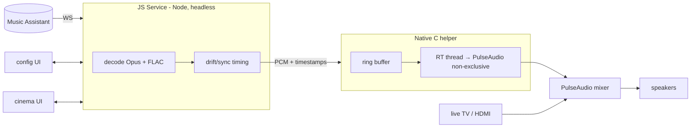

# Progress — Background Audio Daemon IPK

**Resume point for the "convert Sendspin Cinema into a background audio daemon IPK" effort.**
Last updated: 2026-06-21 (Phase 2 sink validated on-device; JS service skeleton scaffolded).

Full design lives in [`docs/background-daemon-ipk-plan.md`](./background-daemon-ipk-plan.md).
This file is the short "where are we / what's next" snapshot.

---

## Status at a glance


- ✅ **Phase 2 — COMPLETE on hardware (2026-06-21).** Production sink `node → gst-launch stdin (fdsrc) → pulsesink` validated for both MVP codecs, AND `sendspin-core.js` (extracted protocol/time-sync/state/player, Web-Audio decode dropped) **runs on the TV's node 8.12** and drives the full real-audio path end-to-end: 31 protocol-framed FLAC chunks → `GstAudioProcessor` → `GstSink` → `pulsesink`, clean EOS. See "Phase 2 — core VERDICT" below.
- ✅ **Phase 3 — JS service packaged, installed, REGISTERED, and live MA round-trip PROVEN (2026-06-21).** Single IPK (`package-ipk.sh`) installs app + service; the service registers on the Luna bus (`luna://com.sendspin.cinema.service/status` returns live state) and completes the full authenticated Sendspin handshake against MA 2.8.3. See "Phase 3 — VERDICT" below. **Remaining:** keep-alive so it doesn't idle out (Phase 5), config UI (Phase 4), and actually routing a queue to the player to hear audio.
- ✅ **Phase 1 — PASSED on real hardware (2026-06-20).** Background audio mixes with a live input. See "Phase 1 — VERDICT" below.
- ✅ **Phase 0 — COMPLETED on real hardware (2026-06-20).** Decode feasibility answered, and it **changed the decode strategy**: the on-device node is too old for the WASM decoders, but on-device **gstreamer** decodes FLAC to mixable PCM and plays it through `pulsesink`. Opus is the one open codec risk. See "Phase 0 — VERDICT" below.
- ⬜ Phases 2–6 not started.

---

## Phase 3 — VERDICT: ✅ packaged, registered, live MA handshake proven (2026-06-21)

### Single IPK with app + background service — `package-ipk.sh`
`ares-package -n APP_DIR SERVICE_DIR` (the `-n`/no-minify is required: the app ships
`sendspin-lib.js` as a raw ES module and ares' bundled terser aborts on `import/export`).
The script stages clean `app/` and `service/` trees (no build/test/docs/node leakage),
ensures the service is built (`build.sh`), and bundles `node_modules/ws`. Output:
`dist/com.sendspin.cinema_<ver>_all.ipk` (~1 MB). `ares-package -i` confirms
`services: ["com.sendspin.cinema.service"]`.

### Installed + registered on the rooted TV
Copied the IPK over SSH and installed via the homebrew dev path:
`luna-send -n 1 luna://com.webos.appInstallService/dev/install '{"id":"com.sendspin.cinema","ipkUrl":"/tmp/sendspin.ipk","subscribe":true}'`.
Lands at `/media/developer/apps/usr/palm/{applications/com.sendspin.cinema, services/com.sendspin.cinema.service}` (with bundled `ws`). Calling
`luna://com.sendspin.cinema.service/status` **returns our real `snapshot()`** — first call ~2.8 s
(node cold-start loading core+ws), then ~4 ms. **The service is live on the Luna bus.**

### ⚑ MA 2.8 requires WebSocket AUTH before the Sendspin protocol — SOLVED
The single remaining unknown turned out to be auth. MA ≥2.8 fronts `/sendspin` with a proxy
(`controllers/webserver/sendspin_proxy.py`) that **closes the socket with `code 4001
"First message must be auth"`** unless the client's first frame is:
```json
{"type":"auth","token":"<MA access token>","client_id":"<player id>"}
```
…to which it replies `{"type":"auth_ok"}` and then transparently proxies the normal protocol
(`client/hello` → `server/hello` → …). The bundled `sendspin-lib.js` predates this and sent
`client/hello` first → 4001. **Get the token** via the main API WS: connect `ws://host:8095/ws`,
wait for the `server_id` info frame, send
`{"command":"auth/login","message_id":"…","args":{"username","password"}}`, read
`result.access_token` (a ~30-day JWT). NOTE: this MA serves both `/ws` and `/sendspin` on the
**webserver port 8095**, not the old dedicated `8927`.

**Proven on-device, end-to-end** (`live-auth-test.js` on the TV → the LAN MA server,
credentials supplied at runtime): login → token → `/sendspin` → auth → **`auth_ok`** → `client/hello` →
**`server/hello`** → `server/state` + `group/update` flowing → clean close. (No audio yet:
`stream/start` never arrived because nothing was queued to this player; the player does now
register/auto-whitelist in MA as "Sendspin Cinema".)

### ⚑ Open: the managed service's connection doesn't persist (→ Phase 5 keep-alive)
Driving the **installed service** over Luna (`setServer {server,username,password}` + a held
`status` subscription) reaches **`status:"paused"`** with `track` populated — i.e. it logs in,
authenticates, and receives MA `server/state`/`group/update` — but every snapshot reports
`connected:false`, whereas the **identical code run as a plain `node` process holds
`isConnected:true` for 12 s+** (`svc-path-test.js`). Same bundle, same `node-env`, same MA. The
delta is the webOS background-service lifecycle: the managed JS service is suspended/throttled when
not actively servicing a Luna call, so the persistent WebSocket can't be maintained. This is exactly
what **Phase 5** fixes (register a `com.webos.service.activitymanager` activity to keep the service
resident with a live event loop; `bootd` for auto-start). Until then auth + protocol are proven;
connection *persistence* is the remaining gap before audio can flow.

### Auth baked into core + service (rebuilt + reinstalled + verified 2026-06-21)
- `build-core.mjs` now injects an **auth preamble** into `SendspinPlayer.connect`: on ws open it
  sends the `{type:auth,token}` frame and gates `client/hello` behind `auth_ok` via an instance
  `_authed` flag (reset each open so reconnects re-auth). Two exact-string anchor replacements,
  asserted.
- `ma-login.js`: `getToken(hostPort, user, pass, cb)` — the `/ws` `auth/login` exchange above.
- `service.js`: `setServer` now accepts `{server, username, password}`; `connect()` fetches a
  token first (when a username is set) then constructs `SendspinPlayer({authToken})`. `snapshot()`
  echoes `username` but never the password. Default port → 8095.
- ✅ Rebuilt (`build-core.mjs` → esbuild, `auth_ok` present, 0 optional-chaining), repackaged
  (`package-ipk.sh`, now also bundles `ma-login.js`), reinstalled. Verified via the installed code:
  `svc-path-test.js` does `ma-login` → `SendspinPlayer({authToken})` → `auth ok` → `Connected to
  server` → `isConnected=true`. Through the managed Luna service it logs in + authenticates
  (`status:"paused"`) but does not stay connected — see the keep-alive note above.
- **TODO:** Phase 5 keep-alive (the persistence blocker above); token refresh on expiry (reconnect
  reuses the captured ~30-day JWT); credential persistence across service idle-out (state resets to
  defaults when webOS recycles the service).

---

## Phase 2 — core VERDICT: 🟨 EXTRACTED + host-validated, on-device load pending (2026-06-21)

`sendspin-core.js` now exists: the Music-Assistant client + time-sync + state + player
logic lifted out of the 24k-line browser bundle `sendspin-lib.js`, with the Web-Audio
decode/schedule engine **removed** and replaced by a headless processor that forwards
encoded frames to the gstreamer sink.

### How it was extracted (reproducible — `build.sh`)
- The `~20k` lines of embedded Opus/FLAC **WASM decoders are dropped entirely** (gstreamer
  decodes). The decoder-free "keeper" block (`sendspin-lib.js` lines **1778–3085**:
  `ProtocolHandler`, `StateManager`, `WebSocketManager`, `SendspinTimeFilter`, `MessageType`,
  `SendspinPlayer`, helpers) was verified to contain **zero** decoder/AudioContext refs and
  exactly **one** `new AudioProcessor(...)`.
- `build-core.mjs` slices that block (with anchor asserts so line drift fails loudly), swaps
  the one `new AudioProcessor(...)` for **`new GstAudioProcessor(...)`**, wraps it as an ESM
  entry, and re-exports the public API.
- **esbuild** (`--target=node8.12 --format=cjs`) transpiles `?.`/`??`/etc. down to node 8 →
  `sendspin-core.js` (42 KB, 0 occurrences of `?.`/`??`).

### The Web-Audio replacement — `src/gst-audio-processor.mjs`
`GstAudioProcessor` implements the exact method surface the unmodified protocol/player call
(`initAudioContext`, `clearBuffers`, `handleBinaryMessage`, `updateVolume`, `setSyncDelay`,
`setCorrectionMode`, `close`, `syncInfo`, …). `handleBinaryMessage` parses the player audio
chunk (**byte0 == 4**, then BE int64 µs timestamp, then encoded payload) and writes the
**encoded payload** straight to an injected sink. Time sync still runs (server gets
`client/time` replies); gstreamer owns the playback clock. Multi-device drift correction is
intentionally out of scope for the MVP.

### Codec negotiation falls out correctly for free
With no `AudioDecoder`/`navigator` in node, the existing `getBrowserSupportedCodecs()` returns
**`{pcm, flac}`** — exactly the on-device gstreamer capability — so **Opus is never advertised**
to the server. No special-casing needed.

### node-8 env + transport
- `node-env.js` installs the only browser globals the keepers touch: `WebSocket` (bundled
  pure-JS **`ws@7.5.10`**, `--no-optional` so no native addons → portable to armv7 softfp),
  `performance` (perf_hooks), `URL` (url), `window` (aliased to `global` for the timer calls).
- TV already ships `webos-service` + `usocket` in `/usr/lib/node_modules`; only `ws` is vendored.

### Validation
- **Host node 22 (`smoke-test.js`):** core loads; `performance.now()`, `WebSocket.OPEN` present;
  `SendspinPlayer` constructs; fake `flac` format + a `[4][ts][payload]` chunk →
  **1 sink created, 1 encoded payload forwarded**; `connect()` to a dead host rejects cleanly.
- **✅ On-device node 8.12 (`smoke-test.js`):** identical results on the TV — bundled `ws`
  provides `WebSocket` (OPEN=1), `performance.now()` works, player constructs, 1 sink / 1 forward,
  `connect()` → clean `ECONNREFUSED`.
- **✅ On-device real-audio path (`test-real-sink.js`):** the real `GstSink` (not a fake) fed by
  `GstAudioProcessor` from `/tmp/test.flac` re-framed into 31 protocol chunks → gst
  `PREROLL → PLAYING → GstPulseSinkClock → clean EOS`, `Execution ended after 0:00:02.081`,
  exit 0. **This is the exact data path a live Music Assistant stream uses, end-to-end on node 8.**
- **Still untested:** the WebSocket handshake/codec negotiation against a *running* Music
  Assistant (needs an MA instance on the LAN). **Do not reboot the TV.**

---

## Phase 2 — sink VERDICT: 🟨 sink path PROVEN on-device (2026-06-21)

The single biggest open architectural question after Phase 0 — *can the node-8 service
actually drive a streamed gstreamer decode into pulsesink?* — is answered **YES**, for
both MVP codecs, on the real TV (`root@192.168.1.32`).

### What ran (canonical wget transport, host `192.168.1.244`)
1. **FLAC, streamed via node:** `feed_gst.js` (node 8.12) spawns
   `gst-launch-1.0 fdsrc fd=0 ! flacparse ! avdec_flac ! audioconvert ! audioresample ! pulsesink`,
   then chunk-feeds `/tmp/test.flac` (126 551 B, 4 KB chunks **with real `write()` backpressure /
   `drain`**) into the child's stdin. Result: `PREROLLING → PREROLLED → PLAYING`, new
   `GstPulseSinkClock`, clean **EOS**, `Execution ended after 0:00:02.081` (matches the 2 s sample),
   `gst exit code=0`. This is exactly the production shape `node service → gst stdin → pulsesink`.
2. **Raw PCM (S16LE/48k/stereo):** generated `/tmp/test.pcm` (192 512 B ≈ 1.003 s) on-device, then fed
   through the **exact** service.js PCM pipeline `fdsrc ! rawaudioparse use-sink-caps=false format=pcm
   pcm-format=s16le sample-rate=48000 num-channels=2 ! audioconvert ! audioresample ! pulsesink`.
   Result: `PLAYING`, `GstPulseSinkClock`, clean **EOS**, `Execution ended after 0:00:01.153`, rc 0.

Both `rawaudioparse` and `fdsrc`/`appsrc` confirmed present via `gst-inspect-1.0`. `test.flac`/`test.opus`
survived in `/tmp` from the Phase 0 run (TV uptime 5 h, no reboot).

### What this nails down
- **node → gst stdin → pulsesink is the production sink.** No WASM, no `pacat`, no cross-compile, no
  custom C. `native/audio-helper/` stays a pure fallback.
- **Both MVP codec contracts work** end-to-end on the box: FLAC (zero custom decode) and raw PCM. Pick
  per Music Assistant output config; Opus stays out until an asm.js decoder (Phase 0 risk).
- The sink lifecycle (spawn / stdin-feed / backpressure / EOS / exit) is captured as the `GstSink`
  class in the new `service.js`.

### Scaffolded this session — JS service skeleton (Phase 3 surface)
`services/com.sendspin.cinema.service/`:
- **`service.js`** — `webos-service` Luna registration (`play`, `pause`, `stop`, `setServer`,
  `setPlayerName`, `setBootOnStart`, `status` subscription) + the hardware-validated **`GstSink`**
  (codec-aware pipeline: FLAC default / PCM) + a dev `play({file})` feed path that exercises the sink
  on-device. node-8 compatible (`var`/no-arrow), `node --check` clean. **TODO:** Music Assistant WS
  client (replaces the file feed → `sink.write(frame)`), real PAUSED transition, `bootd` wiring.
- **`services.json`** / **`package.json`** — Luna service manifest + node manifest (`main: service.js`).
- Still to bundle for the IPK: `node_modules/webos-service`.

Spike artifacts on host: `/tmp/p2stage/feed_gst.js`. TV files in `/tmp` (tmpfs).

---

## Phase 0 — VERDICT: ✅ COMPLETE (ran on the local rooted TV, 2026-06-20)

Goal: prove we can decode Opus + FLAC at stream rate on-device. Answered — and the answer **redirects the decode strategy** away from JS/WASM toward on-device gstreamer.

### Transport blocker — SOLVED
The previous attempt died on file transport. Fixed this run, cleanly:
- TV has **both `wget` and `curl`**. Host ran `python3 -m http.server 8099`; the TV pulled every file in **one connection each** (`wget http://<host>:8099/<file>`). No scp, no base64 chunk storm, no session exhaustion, no reboot. This is the canonical transport from now on.

### The on-device node is too old for the WASM decoders — HARD WALL
TV node is **v8.12.0** (V8 6.2, Nov-2017). The pure-WASM decoders (`opus-decoder`, `@wasm-audio-decoders/flac`) were made to run, JS-syntax-wise, by bundling each `dist/*.min.js` through **esbuild `--target=node8.12`** plus runtime polyfills injected ahead of `require`:
- `globalThis` → `global`; `Array.prototype.flat`/`flatMap`; `TextDecoder`/`TextEncoder` from `require('util')`; `@eshaz/web-worker` aliased to a no-op `Worker` stub (we only use the synchronous, non-worker decoder path, but its `require('worker_threads')` is top-level).

After all that the JS loads — and then **both decoders fail identically at WASM instantiation**:

```
CompileError: WasmCompile: Wasm decoding failed: unexpected section: Code @+NNN
```

Node 8.12's WebAssembly engine is MVP-era and rejects the modern emscripten output (it emits a bulk-memory **`DataCount`** section the old validator doesn't know, then mis-reads the following `Code` section). **No amount of JS down-levelling fixes this** — it's the WASM binary vs. the old engine. So "decode Opus/FLAC inside the TV's node via WASM" is **not viable as-is**. (A node8-MVP-targeted emscripten rebuild or an asm.js build would be required to revive this route — asm.js is plain JS and runs on the existing node 8, **no upgrade needed**.)

### Can we just upgrade the on-device node? — Investigated, NO (not with a stock binary)
- The system node `/usr/bin/node` sits on a **read-only** overlay (squashfs `/` is `ro` and 100% full) — it cannot be replaced. The supported shape would be **bundling our own node inside the IPK** and running the service under it (native service), not overwriting the system one.
- But the TV node reports **`arm_float_abi: "softfp"`** (fpu neon, armv7, glibc 2.28, loader `/lib/ld-linux.so.3`). **Official nodejs.org `linux-armv7l` builds are hard-float (`armhf`/VFP).** Dropping `node-v16.20.2-linux-armv7l` on the TV and running it via the loader gave `error while loading shared libraries: internal error` — the classic **hardfp-binary-on-softfp-system** rejection. glibc/libstdc++ (6.0.25) are new enough; the **float ABI is the wall.**
- So upgrading node means **sourcing or cross-compiling a `softfp` armv7 (glibc ≤2.28) node ≥12 build** (the webOS NDK toolchain, matching `softfp`/`neon`) — a real, separate effort and a new bundled dependency. **Not worth it:** gstreamer already covers decode with zero node involvement, and the only thing an upgrade would buy (Opus-in-JS via WASM) is achievable with **asm.js on the existing node 8.** Recommendation: **keep node 8** for control/protocol logic, decode in gstreamer.

### The win: on-device gstreamer decodes to mixable PCM
The TV ships a full gstreamer 1.x with audio plugins. This sidesteps both the WASM wall and any cross-compile:

| Codec | On-device decoders | Result |
|-------|--------------------|--------|
| **FLAC** | `avdec_flac` (libav, software), `flacdec`, `omxflacdec` (HW), `flacparse`, `/usr/bin/flac` CLI | ✅ **Works fully.** `filesrc ! flacparse ! avdec_flac ! audioconvert ! pulsesink` **played the 2 s sample end-to-end (2.08 s, clean exit)**. Decode to `fakesink sync=false` finished in ~0.1 s wall → **~20× realtime in software.** |
| **Opus** | `omxopusdec` (HW) only — **no software decoder** (no `avdec_opus`, `opusparse`, `opusdec`, or `opusdec` CLI) | ⚠️ **Open risk.** `omxopusdec` src caps are `audio/x-raw(mode:passthrough)` — a **hardware-tunneled** buffer that will not link to userspace `audioconvert`/`pulsesink` (`could not link omxopusdec to audioconvert`). It feeds the TV's HW audio path, not our mix. So Opus is **not** decodable to mixable userspace PCM on this box today. |

Also present and relevant: `pulsesink`/`pulsesrc`, `alsasink`, `mpg123` (MP3 CLI).

### What this changes
- **The JS service does not need to decode audio.** Hand the encoded network stream to a gstreamer pipeline → `pulsesink` (which mixes with live HDMI per Phase 1). FLAC needs **zero** custom decode code, zero WASM, zero cross-compile — strictly better than the `pacat`-fed-PCM plan.
- **Opus is the single codec risk.** Mitigations, easiest first: (a) configure **Music Assistant to stream FLAC or raw PCM** (MA supports output-format selection) and treat Opus as unsupported; (b) ship a pure-**asm.js** opus decoder (runs on node 8, no WASM) feeding `pacat`; (c) recompile libopus to MVP-WASM/asm.js. Recommend (a) for the MVP.
- **Decision #2 (helper language) shifts again:** the decode+sink is now **gstreamer (C, on-device, HW-assisted)**. `native/audio-helper/` and the `pacat` path both demote to optional fallbacks (needed only for Opus-via-asm.js or for tighter buffer control).

**Repro:** all artifacts staged on host at `/tmp/decstage/` (`bench.js` with the node8 polyfills, esbuild-bundled `opus8.js`/`flac8.js`, `worker-stub.js`, `test.opus`, `test.flac`); benchmark commands and the gstreamer pipelines above were run over the wget/HTTP transport. TV files live in `/tmp` (tmpfs — gone on power cycle; nothing installed/persisted).

---

## Phase 1 — VERDICT: ✅ PASS (tested on the local rooted TV)

**The gating question is answered: webOS mixes our background PulseAudio audio with a live external input, no role/policy tricks needed, no ducking.**

Hardware: `LGwebOSTV` kernel 4.4.84, **armv7l** (32-bit ARM), PulseAudio 9.0, node + `paplay`/`pacat`/`pactl`/`luna-send` all present on-device. No `gcc`/`cc` on-device.

Evidence gathered:
- Audio topology: one real ALSA sink `pcm_output` (card `mlpscardaudio`) + per-category **null-sinks** (`pmedia`, `pdefaultapp`, `palerts`…) managed by `audiod`.
- A plain PulseAudio client (`node tone.js | pacat`) → routed to `pcm_output`, **Corked: no, Volume 100%, sink RUNNING**.
- `media.role=music` did **NOT** divert to the `pmedia` null-sink — stayed on `pcm_output`. **Roles unnecessary.**
- Two simultaneous streams both landed on `pcm_output`, both uncorked → **PA native-mixes them**.
- This happened while **foreground app = `com.webos.app.hdmi3`** (a live HDMI input). `audiod` never corked/ducked our stream. Master mixer `on`/100%, scenario `mastervolume_tv_speaker`.
- **User confirmed by ear:** the 440 Hz tone and HDMI3 source audio played **mixed, simultaneously**.

### ⚑ Architecture impact (changes Decision #2)
- **HDMI/TV audio bypasses PulseAudio** (hardware path) and is mixed downstream; PulseAudio is just the app/system-sound mix → our audio mixes "for free."
- **No custom cross-compiled C binary is required.** `pacat` already exists on-device and is the RT-safe PA writer. The planned "JS Service → native helper over a pipe" architecture is realized as **`node service → pacat stdin`** — zero cross-compilation, which deletes the single biggest risk in the plan.
- A custom C helper (or a node libpulse N-API addon) becomes an *optional later optimization* for tighter buffer control, not a prerequisite. `native/audio-helper/` is kept as that fallback.
- **No `media.role` needed**; connect as a plain client to the default sink.

---

## Locked decisions

| # | Decision | Choice |
|---|---|---|
| 1 | FLAC support | **Required** (Node-capable decoder: WASM `libflac.js` or native addon) |
| 2 | Helper language | **Standalone C/C++ binary** (RT thread + lock-free ring buffer; most performant) |
| 3 | Boot auto-start | **Selectable, default ON** (`bootOnStart` flag → registers/unregisters `bootd`) |
| 4 | UI scope | **Both** headless config UI **and** full cinema now-playing UI; both thin Luna clients |

---

## Target architecture (recap)



---

## What is DONE

- **Repo analysis:** `type: "web"` foreground app; `sendspin-lib.js` decodes Opus/FLAC and schedules via **Web Audio API** (`AudioContext`) — the core blocker (won't run in a headless Node service / suspends when backgrounded).
- **Plan doc** written with options analysis, IPK layout, audio-policy/mixing approach, keep-alive strategy, phased migration, risks → `docs/background-daemon-ipk-plan.md`.
- **Phase 1 helper spike** → `native/audio-helper/`:
  - `audio_helper.c` — `pa_simple` playback in a `SCHED_FIFO` thread; `media.role` via `PULSE_PROP`; source = tone / file / stdin / FIFO (FIFO/stdin = future JS-Service feed).
  - `CMakeLists.txt` — cross-build, pkg-config or link-by-name fallback.
  - `README.md` — NDK build, scp-to-TV deploy, and the **role matrix experiment**.
  - **Verified:** compiles `-Wall -Wextra` 0 warnings; host stub-sink test = exact 192000 bytes for 1 s 48 k stereo, peak 8191 (−12 dBFS), correct sine. Logic sound.

## What is BLOCKED / NEXT

Nothing is hardware-blocked — Phases 0 and 1 both passed. Revised path now that **gstreamer decodes on-device** (no JS/WASM decode, no cross-compile):

1. ~~**Phase 0:** benchmark on-device node decode.~~ ✅ Done — see verdict above. Conclusion: **do not decode in node; decode in gstreamer.**
2. **Decide the codec contract first (cheap, unblocks Phase 2):** confirm Music Assistant can serve **FLAC or raw PCM** to this player and make that the MVP format. Opus stays out until an asm.js decoder or MA transcode is in place (see Phase 0 "Opus is the single codec risk").
3. ~~**Phase 2 (sink):** spawn a gstreamer pipeline fed via `fdsrc` from the service.~~ ✅ Done — `GstSink` in `service.js`, validated on-device for FLAC + PCM (see Phase 2 verdict). `native/audio-helper/`/`pacat` remain fallbacks.
4. ~~**Phase 2 (core):** extract `sendspin-core.js`, drop Web-Audio, feed gst sink, validate on node 8.~~ ✅ Done & validated on-device (load + full real-audio path, see core verdict).
5. ~~**Phase 3 (wiring):** wire core into `service.js`.~~ ✅ Done — `service.js` builds a `SendspinPlayer`, injects the `GstSink` factory, maps `onStateChange`→status, forwards `play/pause/stop/next/previous` as controller commands. **Remaining before Phase 4:** (a) **live test against a running Music Assistant** — the only unproven hop is the WS handshake + codec negotiation; (b) register the service in a Luna bus / install the IPK so `service.register` actually binds; (c) `pactl` volume in `GstAudioProcessor.updateVolume`; (d) confirm MA's Sendspin path/port (`/sendspin`, default 8927) against a real instance.
6. **Phase 4:** strip audio engine from `index.html`; add `config.html`; both subscribe to service `status` + send commands.
7. **Phase 5:** `activitymanager` keep-alive + `bootd` registration driven by `bootOnStart`.
8. **Phase 6:** package single IPK (app + `services/com.sendspin.cinema.service/`), `ares-install`, field test.

### Optional parallel work (not hardware-blocked)
- Scaffold IPK service skeleton now: `services/com.sendspin.cinema.service/{services.json,package.json}` + `config.html` stub. Can be done while TV testing proceeds.

---

## Key facts to remember on resume

- **Test TV:** rooted webOS on the local network (credentials kept out of the repo — ask the owner), **armv7l**, kernel 4.4.84, PulseAudio 9.0, **node v8.12.0**. Has on-device: `node`, `pacat`, `paplay`, `pactl`, `pulseaudio`, `luna-send`, `amixer`, **`gst-launch-1.0`/`gst-inspect-1.0`** (with `avdec_flac`, `flacdec`, `omxflacdec`, `flacparse`, `omxopusdec`, `pulsesink`, `alsasink`), **`wget`, `curl`**, `/usr/bin/flac`, `mpg123`, `aplay`. Lacks: `gcc`/`cc`, `python3`, software Opus decoder. **Do not issue reboot commands.**
- **Transport (use this):** host `python3 -m http.server 8099` + TV `wget http://<host-LAN-IP>:8099/<file>` — one connection per file, reliable. Beats scp/base64-chunking. (Host LAN IP last seen `192.168.1.244`; TV `192.168.1.32`.)
- **node v8.12.0 is a wall for WASM:** its MVP-era V8 WebAssembly engine `CompileError`s on modern emscripten output. JS-syntax can be polyfilled (see Phase 0), the WASM binary cannot. → **decode in gstreamer, not node.**
- **Audio gating question: ANSWERED YES** — plain PA client mixes with live HDMI, no role needed. Decode+sink = **gstreamer → `pulsesink`** (FLAC proven end-to-end); `pacat` and `native/audio-helper/` are fallbacks. **No cross-compile required.**
- **Host has:** `ares-package`, `ares-install`, `cmake`, `cc` (host-only; can't link libpulse on macOS).
- **Dev Mode** auto-removes side-loaded apps after ~50h.
- App id: `com.sendspin.cinema`; planned service id: `com.sendspin.cinema.service`.
