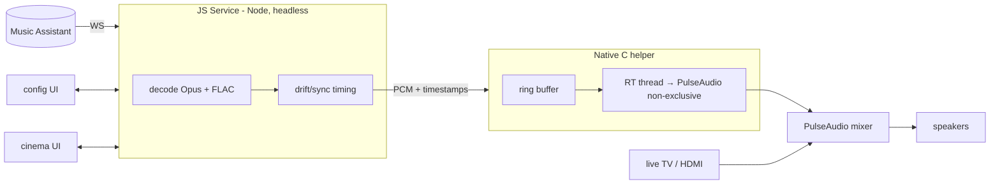

# Progress — Background Audio Daemon IPK

**Resume point for the "convert Sendspin Cinema into a background audio daemon IPK" effort.**
Last updated: 2026-06-20.

Full design lives in [`docs/background-daemon-ipk-plan.md`](./background-daemon-ipk-plan.md).
This file is the short "where are we / what's next" snapshot.

---

## Status at a glance

- ✅ **Phase 1 — PASSED on real hardware (2026-06-20).** Background audio mixes with a live input. See "Phase 1 — VERDICT" below.
- 🟡 **Phase 0 — ATTEMPTED, not completed (2026-06-20).** Benchmark built but never ran — blocked on file transport, not on decode. See "Phase 0 — STATUS" below.
- ⬜ Phases 2–6 not started.

---

## Phase 0 — STATUS: 🟡 incomplete (transport blocker, not a decode blocker)

Goal: measure on-device (armv7l) node decode speed for Opus + FLAC at stream rate.

**Built (on host, ready to reuse):** in `/tmp/decbench/` —
- Real 2 s test samples: `test.opus` (libopus 128k, 23 KB) + `test.flac` (level 5, 127 KB), generated with ffmpeg from a pink-noise+tone source (realistic decode load; duration-independent so 2 s is enough).
- Self-contained **pure-WASM** decoders (no native build, run in plain node): `opus-decoder` (`OggOpusDecoder`) + `@wasm-audio-decoders/flac` (`FLACDecoder`).
- `bench.js` — decodes in a 5 s loop, reports `SPEED=Nx realtime` and `COST=ms per audio-second`.

**Why it didn't finish — transport, not benchmark:**
- This TV's dropbear has **no working scp/sftp** (`scp`/`scp -O` both fail to land files).
- Linux **`MAX_ARG_STRLEN` = 128 KB** caps base64-as-a-single-argument; empirically the working ceiling over the expect/pty wrapper was **~8 KB per command**.
- Falling back to 8 KB base64 chunks (~50 round trips per file) was slow and, run in parallel, **exhausted dropbear's concurrent-session limit → SSH began timing out.** All local jobs killed; no reboot issued. Files left in `/tmp` are tmpfs-only (gone on power cycle); nothing installed/persisted.

**Better transport for next attempt (pick one):**
1. One-shot HTTP: run a temp `python3 -m http.server` on the host, `wget`/`curl` each file from the TV in a single connection (check the TV has `wget`/`curl` first).
2. Single `node -e` over one ssh session that reads base64 from its own stdin and writes the file (one connection, no chunk storm).
3. Keep chunking but **serialize** (never parallel) and raise the per-write size only to the proven ~8 KB.

**Risk read:** low. Pure-WASM Opus/FLAC decode is well within an armv7l budget; Phase 0 is confirmation, not a gate. The real gate (Phase 1 mixing) is already ✅. Phase 0 can be retried anytime or folded into Phase 2 once `sendspin-core` exists.

---

## Phase 1 — VERDICT: ✅ PASS (tested on the local rooted TV)

**The gating question is answered: webOS mixes our background PulseAudio audio with a live external input, no role/policy tricks needed, no ducking.**

Hardware: `LGwebOSTV` kernel 4.4.84, **armv7l** (32-bit ARM), PulseAudio 9.0, node + `paplay`/`pacat`/`pactl`/`luna-send` all present on-device. No `gcc`/`cc` on-device.

Evidence gathered:
- Audio topology: one real ALSA sink `pcm_output` (card `mlpscardaudio`) + per-category **null-sinks** (`pmedia`, `pdefaultapp`, `palerts`…) managed by `audiod`.
- A plain PulseAudio client (`node tone.js | pacat`) → routed to `pcm_output`, **Corked: no, Volume 100%, sink RUNNING**.
- `media.role=music` did **NOT** divert to the `pmedia` null-sink — stayed on `pcm_output`. **Roles unnecessary.**
- Two simultaneous streams both landed on `pcm_output`, both uncorked → **PA native-mixes them**.
- This happened while **foreground app = `com.webos.app.hdmi3`** (a live HDMI input). `audiod` never corked/ducked our stream. Master mixer `on`/100%, scenario `mastervolume_tv_speaker`.
- **User confirmed by ear:** the 440 Hz tone and HDMI3 source audio played **mixed, simultaneously**.

### ⚑ Architecture impact (changes Decision #2)
- **HDMI/TV audio bypasses PulseAudio** (hardware path) and is mixed downstream; PulseAudio is just the app/system-sound mix → our audio mixes "for free."
- **No custom cross-compiled C binary is required.** `pacat` already exists on-device and is the RT-safe PA writer. The planned "JS Service → native helper over a pipe" architecture is realized as **`node service → pacat stdin`** — zero cross-compilation, which deletes the single biggest risk in the plan.
- A custom C helper (or a node libpulse N-API addon) becomes an *optional later optimization* for tighter buffer control, not a prerequisite. `native/audio-helper/` is kept as that fallback.
- **No `media.role` needed**; connect as a plain client to the default sink.

---

## Locked decisions

| # | Decision | Choice |
|---|---|---|
| 1 | FLAC support | **Required** (Node-capable decoder: WASM `libflac.js` or native addon) |
| 2 | Helper language | **Standalone C/C++ binary** (RT thread + lock-free ring buffer; most performant) |
| 3 | Boot auto-start | **Selectable, default ON** (`bootOnStart` flag → registers/unregisters `bootd`) |
| 4 | UI scope | **Both** headless config UI **and** full cinema now-playing UI; both thin Luna clients |

---

## Target architecture (recap)

---

## What is DONE

- **Repo analysis:** `type: "web"` foreground app; `sendspin-lib.js` decodes Opus/FLAC and schedules via **Web Audio API** (`AudioContext`) — the core blocker (won't run in a headless Node service / suspends when backgrounded).
- **Plan doc** written with options analysis, IPK layout, audio-policy/mixing approach, keep-alive strategy, phased migration, risks → `docs/background-daemon-ipk-plan.md`.
- **Phase 1 helper spike** → `native/audio-helper/`:
  - `audio_helper.c` — `pa_simple` playback in a `SCHED_FIFO` thread; `media.role` via `PULSE_PROP`; source = tone / file / stdin / FIFO (FIFO/stdin = future JS-Service feed).
  - `CMakeLists.txt` — cross-build, pkg-config or link-by-name fallback.
  - `README.md` — NDK build, scp-to-TV deploy, and the **role matrix experiment**.
  - **Verified:** compiles `-Wall -Wextra` 0 warnings; host stub-sink test = exact 192000 bytes for 1 s 48 k stereo, peak 8191 (−12 dBFS), correct sine. Logic sound.

## What is BLOCKED / NEXT

Nothing is hardware-blocked anymore — Phase 1 passed. Revised path given `pacat` exists on-device:

1. **Phase 0 (quick, on-device):** benchmark Opus + FLAC decode in **on-device node** at stream rate (armv7l). Confirms the JS-Service decode keeps up before building it.
2. **Phase 2:** extract `sendspin-core.js` from `sendspin-lib.js` — decode + drift/sync logic, replacing the `AudioContext` clock with a monotonic clock + the audio-sink's presentation timeline; add a Node-capable **FLAC** decoder. Output: timestamped PCM.
3. **Phase 2 (sink):** feed PCM to **`pacat` over stdin** (no custom binary needed). Manage buffering/latency via pacat's `--latency-msec`. Keep `native/audio-helper/` only as a future optimization if pacat buffering proves too coarse.
4. **Phase 3:** wrap core in `service.js`, expose Luna methods (`play`, `pause`, `setServer`, `setPlayerName`, `setBootOnStart`, `status` subscription), connect to MA, spawn/feed `pacat`.
5. **Phase 4:** strip audio engine from `index.html`; add `config.html`; both subscribe to service `status` + send commands.
6. **Phase 5:** `activitymanager` keep-alive + `bootd` registration driven by `bootOnStart`.
7. **Phase 6:** package single IPK (app + `services/com.sendspin.cinema.service/`), `ares-install`, field test.

### Optional parallel work (not hardware-blocked)
- Scaffold IPK service skeleton now: `services/com.sendspin.cinema.service/{services.json,package.json}` + `config.html` stub. Can be done while TV testing proceeds.

---

## Key facts to remember on resume

- **Test TV:** rooted webOS on the local network (credentials kept out of the repo — ask the owner), **armv7l**, kernel 4.4.84, PulseAudio 9.0. Has on-device: `node`, `pacat`, `paplay`, `pactl`, `pulseaudio`, `luna-send`, `amixer`. Lacks: `gcc`/`cc`. **Do not issue reboot commands.**
- SSH from host needs `expect` password wrapper (`/tmp/tvssh.exp` pattern) — no persistent key allowed; macOS `scp` needs `-O` and is flaky, prefer `ssh "cat>file"` stdin or base64-echo for small files.
- **Audio gating question: ANSWERED YES** — plain PA client mixes with live HDMI, no role needed. `pacat` is the sink; **no cross-compile required.**
- **Host has:** `ares-package`, `ares-install`, `cmake`, `cc` (host-only; can't link libpulse on macOS).
- **Dev Mode** auto-removes side-loaded apps after ~50h.
- App id: `com.sendspin.cinema`; planned service id: `com.sendspin.cinema.service`.
