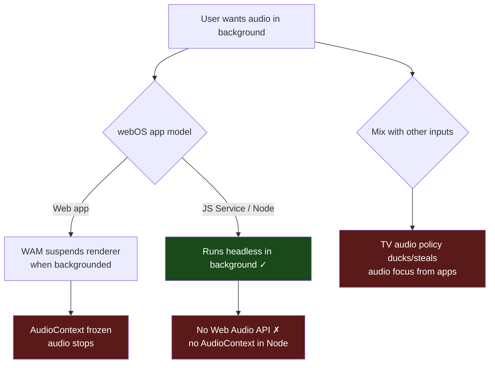
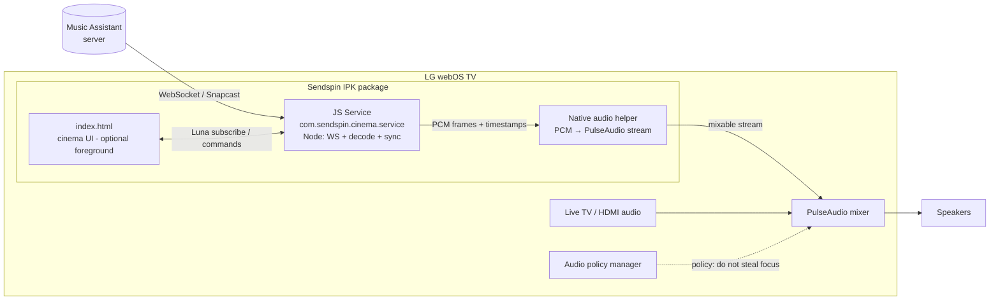
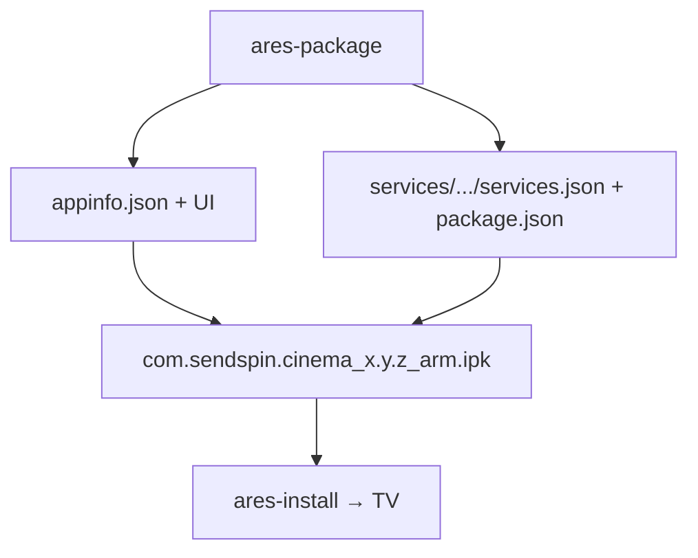
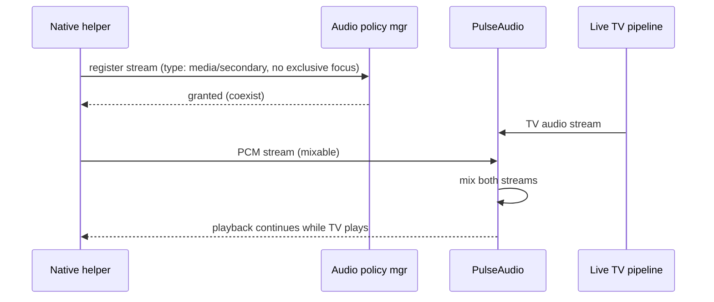
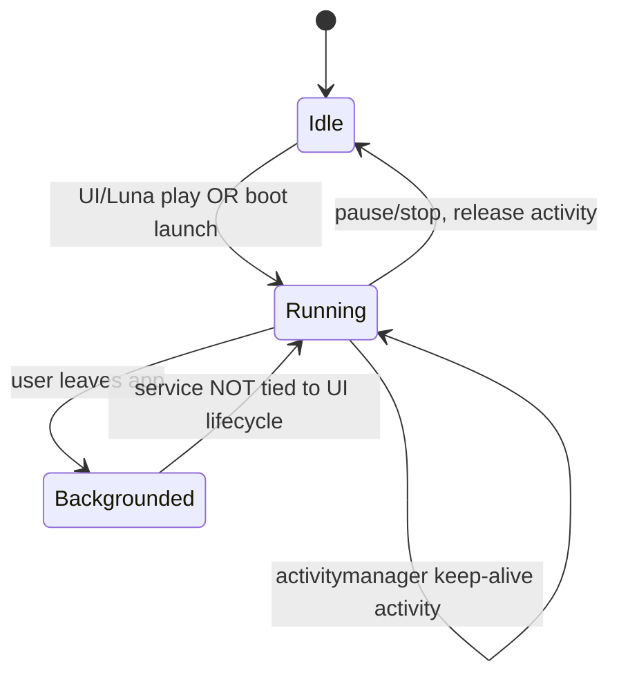
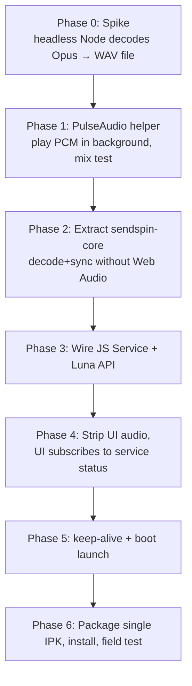
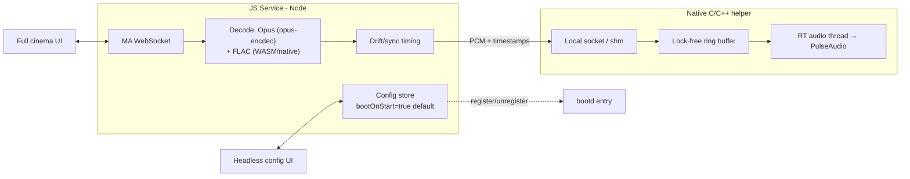

# Plan: Sendspin Cinema → Background Audio Daemon IPK (webOS TV)

**Goal:** Repackage this repo so audio keeps playing in the **background** — concurrently with live TV, HDMI inputs, or other apps — instead of dying when the foreground web app is suspended.

**Current state:** `type: "web"` foreground app. `index.html` + `sendspin-lib.js` decode Opus/FLAC in JS and schedule playback through the **Web Audio API** (`AudioContext`, `createBufferSource`). The renderer is killed/suspended when the user leaves the app, so audio stops.

---

## 1. The core problem

Two hard constraints fight each other:



- **Web apps suspend.** webOS WAM (Web App Manager) suspends a backgrounded web app; `AudioContext` clock halts → audio stops.
- **Background services have no Web Audio.** A `js_service` (Node.js, headless) survives in the background but has **no `AudioContext`** and no direct audio sink. The current decode/scheduling code cannot run there unmodified.
- **Audio focus / mixing.** webOS TV uses PulseAudio + an audio policy manager. Foreground media normally acquires exclusive audio focus; the live-TV pipeline and apps duck or mute each other. "Play simultaneously with other inputs" requires opening a mixable PulseAudio stream and not requesting exclusive focus.

**Conclusion:** This is not a packaging tweak. It needs the audio engine moved out of the browser into a persistent background component that talks to the system audio mixer.

---

## 2. Architecture options

| Option | Background survival | Audio out | Mixing w/ other inputs | Reuse of `sendspin-lib.js` | Effort |
|---|---|---|---|---|---|
| **A. Hidden/headless web app** | ✗ WAM suspends it | Web Audio | poor (focus stolen) | full | low — but doesn't actually work |
| **B. JS Service + native audio bridge** | ✓ | PulseAudio via native helper | ✓ (mixable stream) | partial (port decode, drop Web Audio) | medium-high |
| **C. Native service (C/C++)** | ✓ | PulseAudio direct | ✓ | none (reimplement) | high |
| **D. JS Service streams to webOS media pipeline (`com.webos.media`)** | ✓ | uMediaServer | depends on policy | partial | medium |

**Recommendation: Option B** — a packaged **JS Service** that runs the network/sync/decode logic, paired with a small **native audio helper** that owns a PulseAudio playback stream. Keep the existing `index.html` as an optional thin **control/now-playing UI** that talks to the service over Luna, so the cinema visuals still work when foreground.

Rationale: maximizes reuse of the existing decode + sync logic (port it from Web Audio scheduling to PCM-to-PulseAudio), and PulseAudio is the only layer that cleanly mixes a new stream with existing TV/HDMI audio.

---

## 3. Recommended architecture



**Components:**

1. **JS Service** (`com.sendspin.cinema.service`)
   - Holds the WebSocket connection to Music Assistant / Snapcast.
   - Runs the sync/timing logic from `sendspin-lib.js` (the `nextPlaybackTime` / drift-correction math).
   - Decodes Opus/FLAC to PCM. Opus already uses `opus-encdec` (pure JS, runs in Node). FLAC decode must be a Node-compatible decoder (WASM or native addon).
   - Produces timestamped PCM frames and feeds the native helper.
   - Exposes Luna methods: `play`, `pause`, `setServer`, `setPlayerName`, `status` (subscription for now-playing/progress).
   - Stays alive via an `activitymanager` activity (keep-alive) and/or `bootd` launch on boot.

2. **Native audio helper**
   - Small C/C++ binary (or Node N-API addon) that opens a PulseAudio playback stream at the stream sample rate and writes PCM with presentation timestamps.
   - Critically: does **not** request exclusive audio focus → audio is mixed with live TV/HDMI by PulseAudio.

3. **`index.html` UI (optional)**
   - Reuse existing cinema visuals, but strip the audio engine.
   - Subscribe to the service's `status` for cover art, title, progress; send transport commands over Luna.
   - When foreground: pretty screen. When backgrounded/closed: service + helper keep playing.

---

## 4. IPK package layout

A single IPK bundles the app **and** the service:

```
com.sendspin.cinema/
├── appinfo.json          # type: "web", main: config.html (landing) 
├── config.html           # headless config UI: server IP, player name, boot toggle
├── index.html            # full cinema now-playing UI, audio engine removed
├── Vibrant.min.js
├── icon.png
└── services/
    └── com.sendspin.cinema.service/
        ├── services.json       # service description + Luna methods
        ├── package.json        # node entry, "main": "service.js"
        ├── service.js          # ported sync/decode loop + config store
        ├── sendspin-core.js    # decode+sync extracted from sendspin-lib.js
        ├── flac-decoder.*      # WASM/native FLAC decoder
        └── bin/audio-helper    # native C/C++ PulseAudio binary (ARM)
```



Notes:
- `appinfo.json` stays `type: "web"`; the **service** is what runs headless. Keep `permissions` and add any audio/service permissions required.
- Native helper is architecture-specific (TV SoC is ARM) → build with the **webOS NDK / OSE toolchain**, not the host. This is the riskiest build step.
- `services.json` declares allowed Luna method names and the command/role so the UI (and `luna-send`) can call it.

---

## 5. Audio mixing & policy (the "simultaneous" requirement)



- Open the PulseAudio stream with a **non-exclusive / secondary** role so the policy manager does not duck or kill the TV (and vice-versa). Exact role names are webOS-version-specific — confirm against the target firmware's audio policy config.
- Validate behavior on the actual TV: some webOS builds hard-duck app audio to near-zero when a TV/HDMI source is active. If so, fall back to an explicit "coexist" policy entry or accept ducking.

---

## 6. Keeping the service alive in background



- Register a long-lived **activity** with `com.webos.service.activitymanager` so the JS Service is not garbage-collected when idle and is relaunched if it crashes.
- Optionally register with **`bootd`** to auto-start the daemon on TV boot (true "daemon" behavior).
- The service must hold its own Luna subscription loop; never let it return/exit while playing.

---

## 7. Migration phases



- **Phase 0 — feasibility spike:** prove a headless Node process on the TV can decode an Opus frame to PCM (opus-encdec). Cheapest way to de-risk.
- **Phase 1 — audio out:** build the PulseAudio helper for ARM, play a test PCM file in the background while live TV runs. **This validates the whole premise** (mixing + background). Do it early.
  - **STATUS: ✅ PASSED on TV (2026-06-20).** Validated on real hardware (armv7l, PulseAudio 9.0): a plain PulseAudio client mixes with a live HDMI input at the speakers — **uncorked, 100% volume, no ducking, no `media.role` needed** — confirmed by ear (440 Hz tone + HDMI3 audio simultaneous). See `docs/PROGRESS.md` → "Phase 1 — VERDICT" for full evidence.
  - **Key consequence:** `pacat` already ships on-device, so the production sink is **`node service → pacat stdin`** — **no cross-compiled binary required**, deleting the biggest risk. The C helper in `native/audio-helper/` (written, syntax-clean, host-verified) is retained only as an optional future optimization for tighter buffer control.
- **Phase 2 — extract core:** pull decode + drift/timing logic (`getEstimatedAudioContextTimeSec`, sample-correction fades, scheduling) out of `sendspin-lib.js` into `sendspin-core.js`, replacing the `AudioContext` clock with a monotonic clock + helper presentation timestamps. Replace FLAC path with a Node-capable decoder.
- **Phase 3 — service:** wrap core in `service.js`, expose Luna methods, connect to MA.
- **Phase 4 — UI:** delete the audio engine from `index.html`; subscribe to `status`; send commands.
- **Phase 5 — persistence:** activitymanager + bootd.
- **Phase 6 — package & test:** one IPK, `ares-install`, real-device verification.

---

## 8. Key risks / open questions

| Risk | Impact | Mitigation |
|---|---|---|
| Native helper must cross-compile for TV ARM SoC | Blocks all background audio | Phase 1 spike with webOS NDK/OSE; fall back to a prebuilt PulseAudio CLI if available |
| webOS audio policy hard-ducks app audio under live TV | "Simultaneous" goal not met | Test early (Phase 1); use non-exclusive role; document firmware limits |
| FLAC decode in Node (required) | Some streams won't play | WASM `libflac.js` or native addon; benchmark at stream rate on TV SoC in Phase 0 |
| Sync precision lost moving off `AudioContext` clock | Audible drift / stutter | Drive timing from helper's PA stream timestamps; keep existing correction math |
| Service permissions / Luna ACG on retail firmware | Service can't register methods | Verify in Dev Mode; some Luna calls are privileged |
| Dev Mode app lifetime (auto-removes after ~50h) | Daemon stops | Known Dev Mode limit; note for users, or pursue signed distribution |

---

## 9. Decisions — LOCKED

| # | Decision | Choice | Consequence |
|---|---|---|---|
| 1 | FLAC support | **Required** | Need a Node-capable FLAC decoder (WASM `libflac.js` or native addon) in `sendspin-core`. No Opus-only shortcut. |
| 2 | Native helper language | **Most performant → standalone C/C++ binary** | Separate process, dedicated **real-time-scheduled audio thread**, lock-free ring buffer fed from the JS Service over a local socket / shared memory. Avoids Node event-loop + GC jitter that would cause underruns. Beats an N-API addon for steady low-latency playback. |
| 3 | Boot auto-start | **Selectable, default ON** | Persist a `bootOnStart` flag (default `true`) in service config; register/unregister the `bootd` launch entry based on it. Expose `setBootOnStart` over Luna; surface toggle in config UI. |
| 4 | UI scope | **Both** | Ship a **headless config surface** (server IP, player name, boot toggle) **and** the full cinema now-playing UI. Both are thin Luna clients of the service; neither owns the audio engine. |

### Implications of the locked choices



- **FLAC:** add a Node-side FLAC decoder to Phase 2; verify it keeps up at stream rate on the TV SoC during the Phase 0 spike.
- **C/C++ helper:** the ring buffer + RT thread is what guarantees gap-free background audio independent of Node's scheduling. The JS Service only needs to keep the buffer fed ahead of the playout cursor.
- **Boot toggle:** treat `bootd` registration as a side effect of the config flag — flipping the toggle writes config **and** adds/removes the boot launch entry.
- **Two UIs:** both go in the same IPK. Config UI can be the app's default landing page with a "Now Playing" route into the cinema view.

---

*Generated as an implementation plan. No code changed yet. Phase 1 (PulseAudio background-mixing spike on real hardware) is the recommended first step — it validates the entire approach before any porting effort.*
