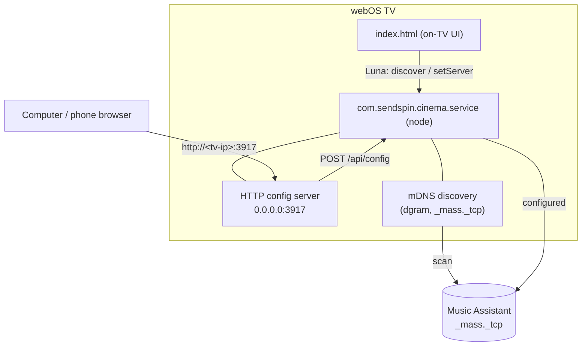

# Easy configuration: LAN web UI + mDNS discovery + remote nav

Goal: stop forcing people to type a server IP and credentials with a TV remote.
Three complementary fixes, all **verified feasible on the real TV (`192.168.1.32`)**.

## What was proven on-device (2026-06-21)

- **LAN HTTP from the TV is reachable** from another computer: a node `http` server
  bound to `0.0.0.0:<port>` on the TV answered a curl from the Mac (no inbound
  firewall block).
- **The TV's node can do mDNS**: a raw `dgram` multicast query for `_mass._tcp.local`
  got a reply from the Music Assistant server (`192.168.1.221`).
- **MA advertises a ready-to-use URL**: its mDNS TXT record contains
  `base_url=http://192.168.1.221:8095` (plus `server_id`, `server_version=2.8.3`,
  `name`). So discovery can return a server URL with **zero typing**.

## Architecture

### 1. LAN config web page (the LG Input Hook pattern) — primary fix
The service runs a small `http` server (default port **3917**) exposing:
- `GET /` — a self-contained config page (server URL, port, username, password,
  player name) plus a **"Scan for servers"** button.
- `GET /api/status` — the current `snapshot()`.
- `GET /api/discover` — runs an mDNS scan, returns `[{name, url, server_id}]`.
- `POST /api/config` — `{server, username, password, playerName}` → drives the same
  internal `setServer`/`setPlayerName` the Luna API uses.

You browse to `http://<tv-ip>:3917` from any device with a real keyboard. No remote
typing at all.

### 2. mDNS discovery — no IP typing
A dependency-free `dgram` module (the proven raw query) scans `_mass._tcp.local`,
parses each reply's TXT `base_url`, and returns a pick-list. Exposed both to the LAN
page (`/api/discover`) and the on-TV UI (a new Luna `discover` command). Optionally
the service also **advertises itself** as `_http._tcp` "Sendspin Cinema" so the TV
shows up in Bonjour/Finder.

### 3. On-TV remote navigation — fallback fix
The current form can't move between fields with a D-pad (WAM does no auto spatial
nav; arrows just move the text caret). Add explicit **Up/Down/Enter** focus handling
over a single-column field list, so the on-TV form is at least usable for people not
near a computer.

## Lifecycle note (honest caveat)
The service only runs once something starts it (the app opening, or — later — a
`bootd` autostart, Phase 5b). The HTTP server will **hold the keep-alive while it is
listening**, so once the app has been opened the config page stays reachable even
after you leave the app. The only gap is "app never opened since boot AND no server
configured" — exactly when you'd open the app anyway. Full always-on is Phase 5b.

## Decisions (settled)
- Scope: **all three** built. Port **3917**. mDNS **discovers MA only** (no self-advertise).

## Status — ✅ built + verified on hardware (2026-06-21)

All three shipped in the service + app and confirmed on `192.168.1.32`:

- **LAN config page** — `config-http.js` serves `http://<tv-ip>:3917` (page +
  `/api/status`, `/api/discover`, `POST /api/config`). Verified from the Mac:
  the page loads, `/api/status` returns the snapshot (now including `configUrl`),
  and `POST /api/config` drives the same `applyConfig` as Luna (status →
  `connecting`, server + player name applied). Reachable across the LAN with no
  firewall tweaks; survives the 5 s idle window (the HTTP server holds the
  keep-alive, so the service stays resident after first launch).
- **mDNS discovery** — `mdns-discover.js` (raw `dgram`, no deps) returns
  `{name, url, server_id, version}`. Verified both via `/api/discover` and the new
  Luna `discover` command: found the LAN MA (`http://192.168.1.221:8095`,
  v2.8.3). MA's TXT `name` is empty, so we label it "Music Assistant".
- **On-TV remote nav** — `index.html` is single-column with explicit Up/Down focus
  walking + Enter to pick a scanned server; adds a "Scan for servers" button and
  shows the `configUrl` hint ("configure from your computer"). Inline JS
  syntax-checked. (IME interaction on the TV keyboard is the rough edge; the LAN
  page is the polished path.)

### Wiring notes / gotchas found
- `config-http` calls `discover(cb)`; the service adapts `mdns.discover(timeoutMs, cb)`
  via a wrapper (arity mismatch otherwise drops the HTTP response).
- Keep-alive is now held from startup (was: only while a server was configured) so
  the config page stays reachable; `disconnect` no longer releases it.
- Lifecycle caveat stands: reachable once the app has launched the service (or, later,
  a `bootd` autostart — Phase 5b). Credentials still reset on a cold boot until then.

### Restarting the managed service on redeploy (dev)
Installing the IPK doesn't replace the *running* service process. To load new code:
kill any proc whose `/proc/<pid>/cmdline` mentions `com.sendspin.cinema.service`
(busybox `ps` truncates names, so match on `/proc/*/cmdline`, not `ps`), then poke
`luna://com.sendspin.cinema.service/status` to relaunch.
